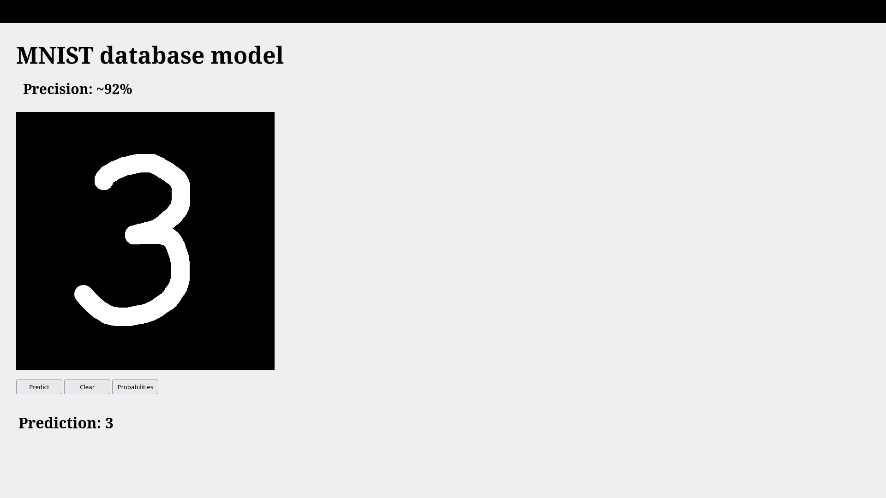
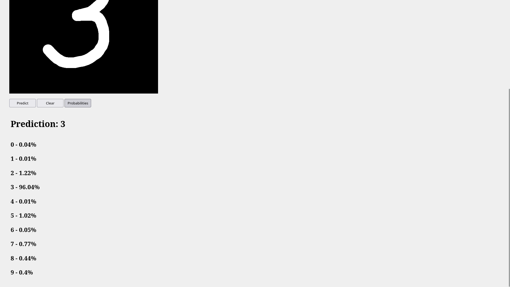
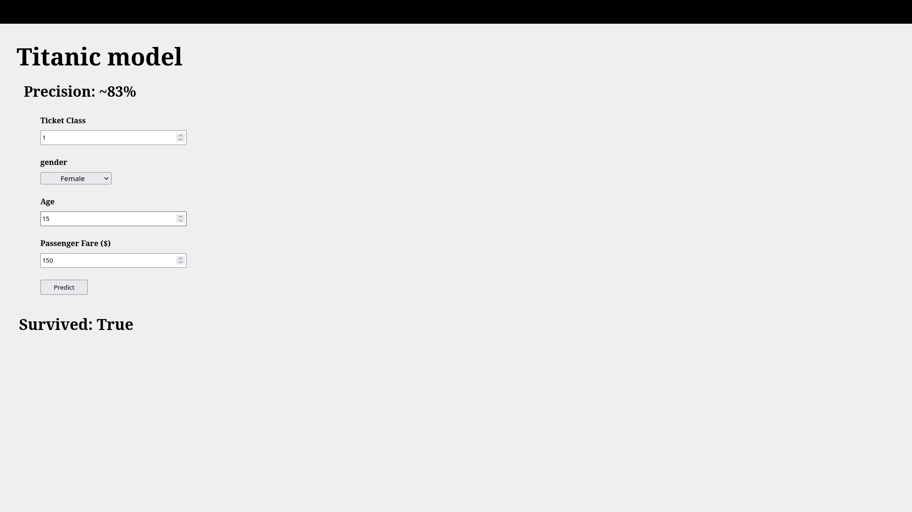
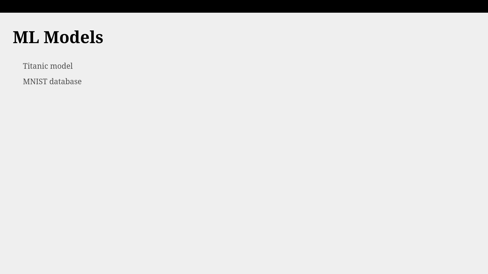

# my-ml-models

This repo contains a web interface for a couple of my pre-trained simple ML models. The feature engineering and models training code for these models is lost in oblivion 


## About models

### 1. Handwritten digits classification trained on MNIST database (with a web canvas).
> **Note.**
> 
> The model was trained on an image dataset where the digits are centered. Currently, there is no logic on the client side to "centralize" handwritten digits before inference; therefore, the results may be inaccurate if the digits deviate from the center.
> 
> Additionally, other forms of input image (canvas) transformations before inference may improve the results.






### 2. Survivorship likelihood prediction model for titanic passengers based on the passenger features such as gender, age, ticket class (1-3), fare ($). Yields either true if survived or false otherwise.




## Running locally
Python version: `3.10.*`

Create venv:
```bash
python -m venv .venv && source .venv/bin/activate
```

Install the dependencies into the virtual environment:
```bash
pip install -r requirements.txt
```

Create `.env` file at the project root with below contents:
```ini
# mandatory
SECRET_KEY="secret-key"
# optional
# DJANGO_SETTINGS_MODULE="config.prod"
# SECURE_SSL_REDIRECT=
```
If you decide to enable prod settings then run this command:
```bash
python manage.py collectstatic
```


Run the django server:
```bash
python manage.py runserver
```

The output should be similar to:
```
Watching for file changes with StatReloader
Performing system checks...

System check identified no issues (0 silenced).
October 01, 2025 - 21:33:12
Django version 4.0.3, using settings 'config.dev'
Starting development server at http://127.0.0.1:8000/
Quit the server with CONTROL-C.
```

Browse the web by going to http://127.0.0.1:8000/

You should see the homepage:



